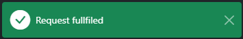
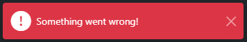
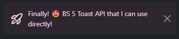

# Wrapper for BS5 Toast

[Edit in StackBlitz next generation editor ⚡️](https://stackblitz.com/~/github.com/3omer/bs5-toast-api)

[Github page](https://3omer.github.io/bs5-toast-api/)


**1️⃣ First Add the container and the js code**

```HTML
<body>
  // ...
  // page
  //...

    <div class="toast-container position-fixed bottom-0 end-0 p-3"></div>
    
    // script
    <script src="path/to/bs5-toast.js"></script>
  </body>
```

**2️⃣ Initiliaze the api with Bootstrap Toast module and a refernce to the toast's container**


```js
toast.init({
  bsToastModule: bootstrap.Toast, 
  container: document.querySelector('.toast-container'), 
});
```

**⭐ Use the toast's method**

</img>

```js
toast.success({ message: 'Request fullfiled' })
```

</img>
```js
toast.error({ message: 'Something went wrong!' })
```

</img>
```js
toast.show({ message: 'Bootsrap primary!', duration: 2000 })
```

</img>
```js
toast.success({
  message: 'Excatly',
  iconCSS: 'ph-duotone ph-star-four' })
```


</img>
```js
toast.show({ 
  message: 'I am bg-white text-dark fw-bold 🙌', 
  theme: 'text-dark bg-white fw-bold',
  iconCSS: 'bi bi-bootstrap-fill text-primary',
  duration: 2000
})
```


</img>
```js
toast.show({
  message: 'Finally! 🤩 BS 5 Toast API that I can use directly!',
  autohide: false,
  theme: 'toast-custom fw-semibold',
  iconCSS: 'ph-duotone ph-rocket-launch'
});
```


